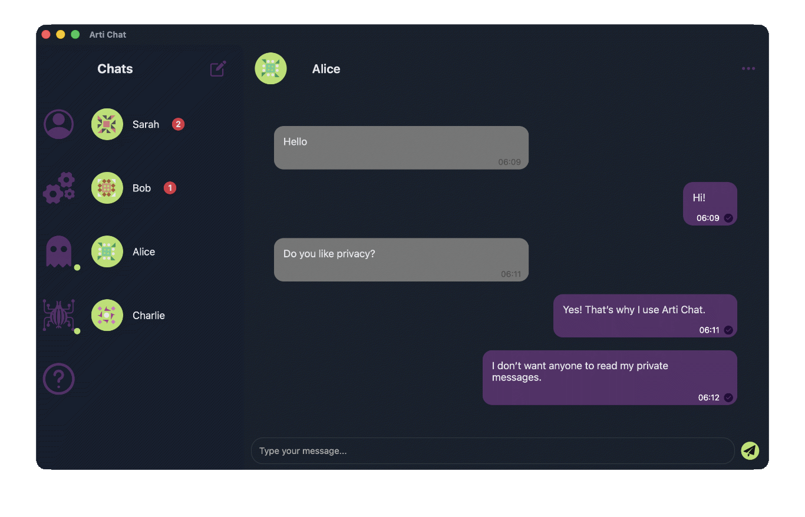

<p align="center">
  
  <h1 align="center">Arti Chat</h1>

  <h3 align="center">"When you need to speak freely."</h3>
  <p align="center">
    While the right for privacy is slowly becoming a luxury reserved for the few, Arti Chat brings it back to the many. You can start chatting with your friends or colleagues today without providing any form of Personal Identifiable Information like an email address, name or phone number. A message you send or receive is routed through the Tor network providing a reasonable level of anonymity. Each conversation is peer-to-peer meaning none of your data or messages are stored on a centralized server. Your speech can't be controlled, outlawed or monitored by any hostile adversary or government since Arti Chat is fully decentralized and does not depend on a single server. Thanks to Tor's strong encryption all your conversations are only readable for you and your peer, remaining a secret for everyone else.
  </p>
  <p align="center">
    Arti Chat is free and open-source.
  </p>
   <p align="center">
		✅ Free and open-source									<br>
    ✅ Fully decentralized and peer-to-peer	<br>
    ✅ Anonymous (Tor)											<br>
    ✅ Encrypted (Tor)											<br>
    ✅ ed25519 sender verification					<br>
    ✅ Data stored locally and encrypted		<br>
  </p>
</p>

<hr>

## Current status

> [!WARNING]  
> Arti Chat is not yet suitable to be used in real-world scenarios.

This is a hobby project still under heavy development. Today Arti Chat is a proof of concept to experiment and test with. A lot of work on the code and architecture is required before even an alpha version will be released. It can only be run on *nix systems like Linux or macOS, Windows is not yet supported.

I am open to feedback.

## Screenshot



More screenshots [here](screenshots)!


## Installation

There will be no bundles available until an official release. For developers wanting to experiment or contribute an install script is provided.

### Prerequisites

This project is made in the Rust programming language and Tauri for the GUI. The following development tools are required for installation:
- Rust ([install guide](https://rust-lang.org/tools/install/))
- Cargo
- Tauri ([install guide](https://tauri.app/start/create-project/#using-create-tauri-app), [install tauri-cli](https://v2.tauri.app/reference/cli/))
- npm ([install guide](https://nodejs.org/en/download/))

### Installation script

Execute the following command in your terminal to run [`developer-install.sh`](developer-install.sh) which is a Bash script. 

```
curl -fsSL https://raw.githubusercontent.com/NielDuysters/arti-chat/240f33a2916ec29e919b071c458b3a3f55300749/developer-install.sh | bash
```

### ⚠️ macOS bug: App keeps loading

Depending on your system's security settings the app is not allowed to launch the daemon or access the system's keyring to store a key
for database encryption.

Temporary workaround:
- Execute command `arti-chat-daemon-bin` in your terminal (installed during install script) and open UI.
- Execute `pkill arti-chat-daemon-bin` to kill the daemon.

## Roadmap

**Arti Chat - Proof of Concept (current):**
- [x] Two peers can chat p2p and decentralized.
- [x] Routing over Tor (Arti).
- [x] ed25519 message signing.
- [x] Simple GUI.
- [x] Encrypted local sqlite database.
- [x] Extensible RPC implementation.
- [x] IPC between GUI and daemon using Unix sockets.
- [ ] Refactor code (atm it's more a draft).
- [ ] Get feedback on code + architecture.
- [ ] Discuss different possible approaches.
- [ ] Solve bugs and instability issues.
- [ ] Option to send images.
- [ ] Group chat?

**Arti Chat - alpha-v0.1.0:**
- [ ] Solid code + architecture.
- [ ] Stable on Linux and macOS.
- [ ] Strong and proven implementations regarding encryption and security.
- [ ] Allow reusing same HsId.
- [ ] Correct implementation for daemon (e.g systemd).
- [ ] Unit tests.
- [ ] Cleanup git repo.

**Arti Chat - alpha-v0.2.0:**
- [ ] Windows support.
- [ ] Improved install script.
- [ ] Improved UI/UX.

**Arti Chat - beta-v0.3.0:**
- [ ] Secure and stable enough for actual usage.
- [ ] App bundles.

**Arti Chat - v1.0.0:**
- [ ] Beta-tested and ready to be used by the masses.
- [ ] Reliable desktop chat app for Linux, macOS and Windows.

**Arti Chat - v2.0.0:**
- [ ] Android + iOS version?

## Contribute

I'm interested in receiving feedback on the code and architecture. A small code-review or tips are appreciated!
